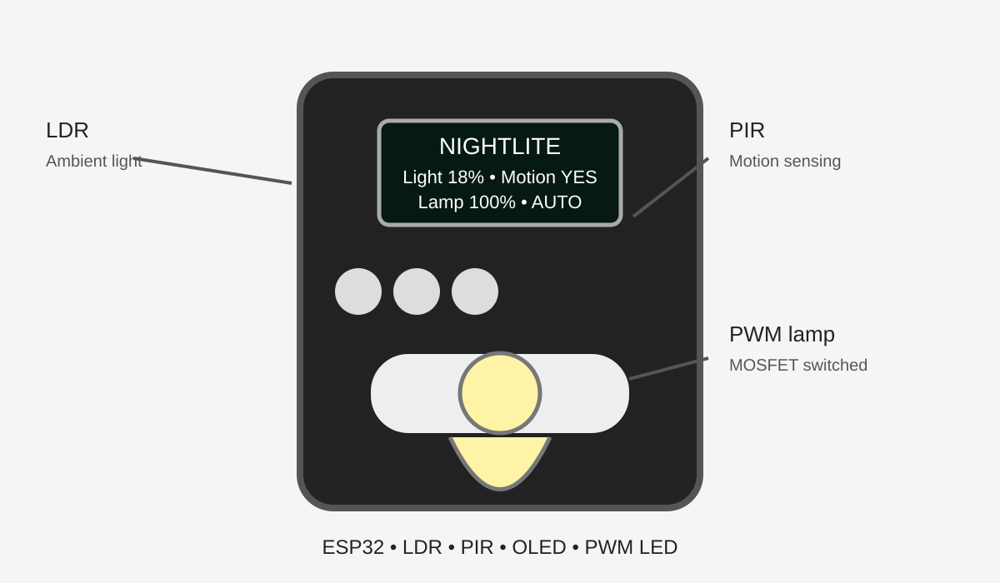

# NightLite 🌙💡

**An ESP32-based automatic desk/night lamp that senses ambient light and motion to intelligently control a lamp.**

> **Project status**: Design complete, firmware written, awaiting hardware for physical assembly and testing. This is a [Hack Club Half Life](https://halflife.hackclub.com) Warm-Up project.



## What it does

NightLite combines an ambient-light sensor, a motion detector, and a small OLED display to create a smart desk lamp that just works:

- **🌑 Automatic mode**: Detects darkness with an LDR and turns on the lamp when motion is detected nearby.
- **💡 Adaptive brightness**: After motion stops, the lamp dims to 40% after a 30-second timeout — enough to see without being harsh.
- **☀️ Bright-room detection**: The lamp stays completely off when the room is already well-lit.
- **🎛️ Manual mode**: Three buttons let you take manual control of brightness at any time.
- **📊 OLED dashboard**: A 0.96″ display shows real-time light level, motion status, lamp output, and current mode.
- **📦 Custom enclosure**: A planned 3D-printed case turns this from a breadboard prototype into an actual desk lamp.

## Hardware

| Part | Role | Approx. cost |
|---|---|---|
| ESP32 DevKit V1 | Main controller (WiFi, 12-bit ADC, LEDC PWM) | $5.00 |
| LDR + 10kΩ resistor | Ambient-light voltage divider | $0.19 |
| HC-SR501 PIR | Motion detection (3–7 m range) | $0.63 |
| 0.96″ SSD1306 OLED | I²C status display (128×64 pixels) | $2.24 |
| AO3400A N-Channel MOSFET | Logic-level PWM lamp switching | $0.15 |
| 5V LED lamp module | Primary light source | $1.20 |
| 3× tactile buttons | Mode toggle + brightness up/down | $0.09 |

**Total estimated cost: ~$14.51** (sourced from India via robu.in and thinkingrobot.in)

The full, machine-readable parts list is in [`bom.csv`](bom.csv).

## How it works

```
  ┌─────────┐     ┌─────────┐
  │   LDR   │────▶│  ESP32  │────▶ OLED Display
  │ (light) │     │         │     (live status)
  └─────────┘     │         │
                  │         │────▶ LED Lamp
  ┌─────────┐     │         │     (via MOSFET PWM)
  │  PIR    │────▶│         │
  │(motion) │     │         │
  └─────────┘     │         │
                  │         │
  ┌─────────┐     │         │
  │ Buttons │────▶│         │
  │ (3x)    │     │         │
  └─────────┘     └─────────┘
```

**AUTO mode logic**:
- Room is bright → lamp OFF
- Room is dark + motion detected → lamp 100%
- Room is dark + no motion (30s timeout) → lamp 40%

**MANUAL mode**: Brightness controlled directly with UP/DOWN buttons.

## Pin map

| Function | ESP32 GPIO | Notes |
|---|---|---|
| LDR divider | GPIO34 | ADC input (input-only pin) |
| PIR sensor | GPIO27 | Digital input, active-HIGH |
| Lamp MOSFET | GPIO25 | LEDC PWM output |
| OLED SDA | GPIO21 | I²C data |
| OLED SCL | GPIO22 | I²C clock |
| Mode button | GPIO14 | INPUT_PULLUP → GND |
| Brightness + | GPIO26 | INPUT_PULLUP → GND |
| Brightness − | GPIO33 | INPUT_PULLUP → GND |

## Repository structure

```
Nightlite/
├── README.md               ← You are here
├── bom.csv                 ← Machine-readable bill of materials
├── BOM.md                  ← Half Life platform mirror
├── JOURNAL.md              ← Development journal / devlog
├── src/
│   └── nightlite.ino       ← Complete ESP32 firmware
├── docs/
│   ├── DESIGN.md           ← Architecture and design rationale
│   ├── FIRMWARE.md         ← Firmware control logic and calibration
│   ├── WIRING.md           ← Complete wiring guide with diagrams
│   ├── ENCLOSURE.md        ← Enclosure design specification
│   ├── 17-HOUR-PLAN.md     ← Build plan with evidence checklist
│   ├── JOURNAL.md          ← Extended dev journal
│   └── PROJECT_DASHBOARD.md← Live project status dashboard
├── schematic/
│   └── nightlite.svg       ← Formal electrical schematic
├── cad/
│   ├── README.md           ← Enclosure overview
│   └── ENCLOSURE_SPEC.md   ← Dimensions, clearances, cutout coords
└── images/
    └── nightlite-concept.svg ← Product concept render
```

## Getting started

### Prerequisites

- [Arduino IDE](https://www.arduino.cc/en/software) (2.x recommended)
- ESP32 board support (install via Board Manager → "esp32 by Espressif Systems")
- Libraries: Adafruit GFX Library, Adafruit SSD1306

### Build and upload

1. Open `src/nightlite.ino` in the Arduino IDE.
2. Select board: **ESP32 Dev Module**.
3. Select port: your ESP32's COM/serial port.
4. Click **Upload**.
5. Open Serial Monitor at **115200 baud** to see debug output.

### First calibration

After uploading, the serial monitor shows ADC readings from the LDR. Use these to calibrate `DARK_THRESHOLD` in the firmware:

1. Note the ADC value in a well-lit room.
2. Note the ADC value in a dark room.
3. Set `DARK_THRESHOLD` midway between those values.
4. Re-upload and verify.

See [`docs/FIRMWARE.md`](docs/FIRMWARE.md) for detailed calibration instructions.

## Documentation

| Document | Description |
|---|---|
| [`docs/DESIGN.md`](docs/DESIGN.md) | Architecture decisions and functional flow |
| [`docs/FIRMWARE.md`](docs/FIRMWARE.md) | Control logic, PWM, debouncing, calibration |
| [`docs/WIRING.md`](docs/WIRING.md) | Complete wiring with circuit diagrams |
| [`docs/ENCLOSURE.md`](docs/ENCLOSURE.md) | Enclosure design and printing guide |
| [`docs/17-HOUR-PLAN.md`](docs/17-HOUR-PLAN.md) | 17-hour build plan with evidence checklist |

## License

This project is open source — built for learning and for the Hack Club community. 🎉
