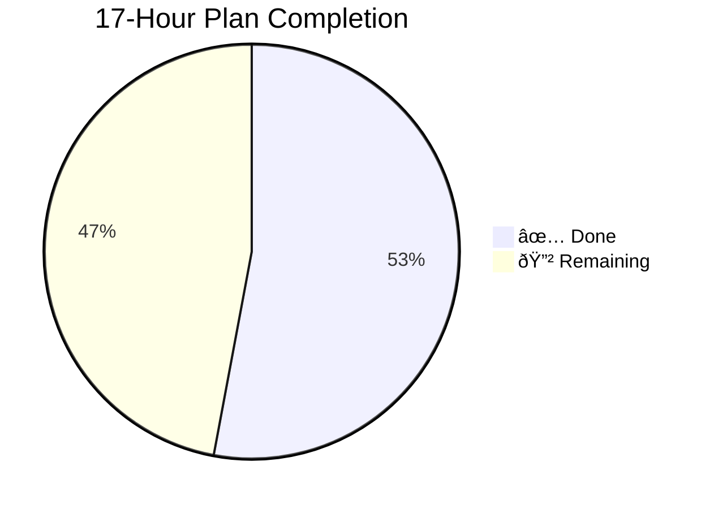
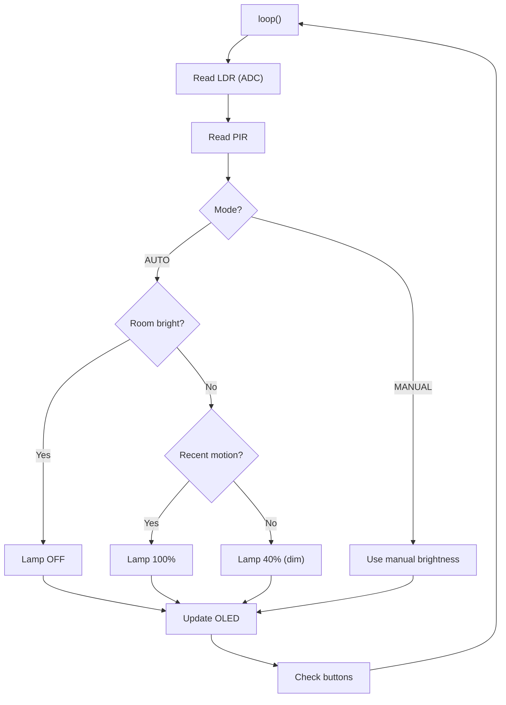

# 🌙 NightLite — Project Status Dashboard

> **Last synced**: 2026-10-02 · **Repo**: [Abhay0090/Nightlite](https://github.com/Abhay0090/Nightlite) · **Stage**: Design / Pre-prototype

---

## 📊 Overall Progress



| Phase | Hours | Status | Deliverables |
|---|---|---|---|
| Requirements & Architecture | 0–2 | ✅ Complete | `docs/DESIGN.md`, `docs/WIRING.md`, pin map frozen |
| Firmware Prototype | 2–5 | ✅ Complete | `src/nightlite.ino` — ADC, PIR, AUTO/MANUAL, OLED, debounce |
| Circuit & Electrical Design | 5–7 | ✅ Complete | `docs/WIRING.md`, `schematic/nightlite.svg` |
| BOM & Sourcing | 7–9 | ✅ Complete | `bom.csv` — India-focused, ~$13.74 estimate |
| Enclosure / CAD Design | 9–11 | ⬜ Not started | `cad/` — placeholder README only |
| Physical Build & Testing | 11–14 | ⬜ Blocked (hardware) | Awaiting component delivery |
| Integration & Polish | 14–16 | ⬜ Blocked | Depends on physical build |
| Final Submission Prep | 16–17 | ⬜ Blocked | Depends on integration |

---

## 🗂️ Repository File Map

```
Nightlite/
├── README.md                  ✅ Concept render + feature summary
├── BOM.md                     ✅ Half Life mirror (auto-generated)
├── JOURNAL.md                 ✅ Half Life mirror (auto-generated)
├── bom.csv                    ✅ India-focused, machine-readable
├── src/
│   └── nightlite.ino          ✅ Full firmware prototype
├── docs/
│   ├── 17-HOUR-PLAN.md        ✅ Full plan with evidence checklist
│   ├── DESIGN.md              ✅ Architecture & functional flow
│   ├── FIRMWARE.md            ✅ Control logic & calibration notes
│   ├── WIRING.md              ✅ Pin map + divider/PIR/OLED wiring
│   └── JOURNAL.md             ✅ Dev journal
├── schematic/
│   └── nightlite.svg          ✅ Formal electrical schematic
├── cad/
│   └── README.md              ⬜ Placeholder only
└── images/
    └── nightlite-concept.svg  ✅ Product concept render
```

---

## 🔧 Hardware Architecture

### Pin Assignments (Frozen)

| Function | GPIO | Type | Notes |
|---|---|---|---|
| LDR divider midpoint | **34** | ADC input | `3.3V → LDR → GPIO34 → 10kΩ → GND` |
| HC-SR501 PIR OUT | **27** | Digital input | Active-high motion detect |
| Lamp MOSFET gate | **25** | PWM output | AO3400A low-side switch |
| OLED SDA | **21** | I²C | SSD1306 @ `0x3C` |
| OLED SCL | **22** | I²C | — |
| Mode button | **14** | Input pullup → GND | Toggles AUTO ↔ MANUAL |
| Brightness UP | **26** | Input pullup → GND | Manual mode only |
| Brightness DOWN | **33** | Input pullup → GND | Manual mode only |

### Key Constants

| Constant | Value | Notes |
|---|---|---|
| `DARK_THRESHOLD` | 1800 | ADC threshold — **uncalibrated, needs real-world tuning** |
| `MOTION_TIMEOUT_MS` | 30000 ms | 30s after last motion → dim lamp |
| `DEBOUNCE_MS` | 180 ms | Button debounce window |
| `manualBrightness` default | 180 / 255 | ~70% duty cycle |

---

## 💰 BOM Summary (India Sourced)

| Component | Cost (USD) | Source |
|---|---|---|
| ESP32 DevKit V1 | $5.00 | [thinkingrobot.in](https://thinkingrobot.in/products/esp32-wroom-32-devkit-v1-wi-fi-bluetooth-iot-board) |
| 0.96″ SSD1306 OLED | $2.24 | [robu.in](https://robu.in/product-category/oled-display/) |
| HC-SR501 PIR | $0.63 | [robu.in](https://robu.in/product/pir-motion-sensor-detector-module-hc-sr501/) |
| LDR Photoresistor | $0.18 | [robu.in](https://robu.in/product/4mm-ldr-sensor-photoresistor-photo-cell-5-10k-gl4516) |
| 10kΩ Resistor | $0.01 | robu.in |
| 220Ω Resistors | $0.01 | robu.in |
| AO3400A MOSFET | ~$0.50 | robu.in |
| Misc (buttons, wires, etc.) | ~$5.17 | — |
| **Total estimate** | **~$13.74** | Excl. shipping |

---

## 🧠 Firmware Architecture



**Key firmware features:**
- **AUTO mode**: Dark + motion → 100% · Dark + no motion (30s timeout) → 40% dim · Bright room → off
- **MANUAL mode**: UP/DOWN buttons adjust brightness in steps
- **Button debounce**: 180ms window, INPUT_PULLUP, active-low
- **OLED fallback**: `oledReady` flag — graceful degradation if OLED fails to init
- **Libraries**: Adafruit GFX + Adafruit SSD1306

---

## ⚠️ Blockers & Open Items

| # | Item | Type | Status |
|---|---|---|---|
| 1 | **Git not installed** on dev machine | Tooling | 🔧 Installing now |
| 2 | **CAD / Enclosure design** not started | Deliverable | ⬜ Needs dimensions, cutouts, mounting |
| 3 | **Hardware not arrived** | Physical | 🚚 Awaiting components |
| 4 | **`DARK_THRESHOLD` uncalibrated** | Firmware | ⏳ Needs real LDR readings |
| 5 | **PIR output polarity** unverified | Hardware | ⏳ Verify with actual HC-SR501 |
| 6 | **OLED I²C address** assumed `0x3C` | Hardware | ⏳ Verify on real module |
| 7 | **LDR divider orientation** assumed | Hardware | ⏳ Verify ADC direction |

---

## 🎯 Next Actions (Priority Order)

1. **Install Git** → clone repo locally → enable direct pushes
2. **CAD enclosure package** — dimensions, OLED cutout, button holes, PIR window, LDR opening, LED diffuser chamber, USB access, ESP32 mounting
3. **Enclosure concept render** — match existing NightLite design language
4. **Wait for hardware** → physical assembly → calibrate `DARK_THRESHOLD`
5. **Integration testing** → verify all sensors + OLED + buttons working together
6. **Final submission prep** — photos, demo video, journal updates

---

> [!NOTE]
> This dashboard is a living document. It will be updated as the project progresses through the 17-hour plan. The repo currently has **BOM + firmware + wiring + schematic + design docs + CAD placeholder + journal + 17-hour plan + concept visualization** — 9 of 17 hours' worth of deliverables are committed.
