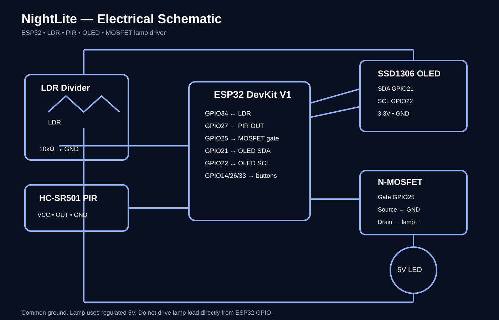

# NightLite Wiring

## Pin map

| Function | ESP32 |
|---|---:|
| LDR divider midpoint | GPIO34 (ADC) |
| HC-SR501 PIR OUT | GPIO27 |
| Lamp MOSFET gate | GPIO25 |
| OLED SDA | GPIO21 |
| OLED SCL | GPIO22 |
| Mode button | GPIO14 → GND |
| Brightness + | GPIO26 → GND |
| Brightness − | GPIO33 → GND |

## LDR divider

Recommended initial arrangement: `3.3V → LDR → GPIO34 → 10kΩ → GND`. The exact ADC direction must be verified on the physical prototype; the firmware currently assumes brighter light produces a higher ADC reading.

## PIR

- VCC → module-appropriate supply
- OUT → GPIO27
- GND → common GND

Confirm the exact HC-SR501 module's output behavior before final assembly.

## OLED

Typical SSD1306 I²C wiring: VCC → 3.3V, GND → GND, SDA → GPIO21, SCL → GPIO22. Firmware assumes I²C address `0x3C`; verify the purchased module.

## Lamp driver

`5V → LED lamp +`  
`LED lamp − → MOSFET drain`  
`MOSFET source → GND`  
`GPIO25 → MOSFET gate`

Use a logic-level N-channel MOSFET rated for the actual lamp current. **Never connect the lamp directly to an ESP32 GPIO.**

## Buttons

Each button connects between its GPIO and GND. Firmware uses internal pull-ups.

## Power

Use regulated USB 5V for the prototype. Keep controller, PIR, OLED and MOSFET grounds common.

## Schematic

All values and connections must be checked against the exact purchased modules before claiming a tested build.
